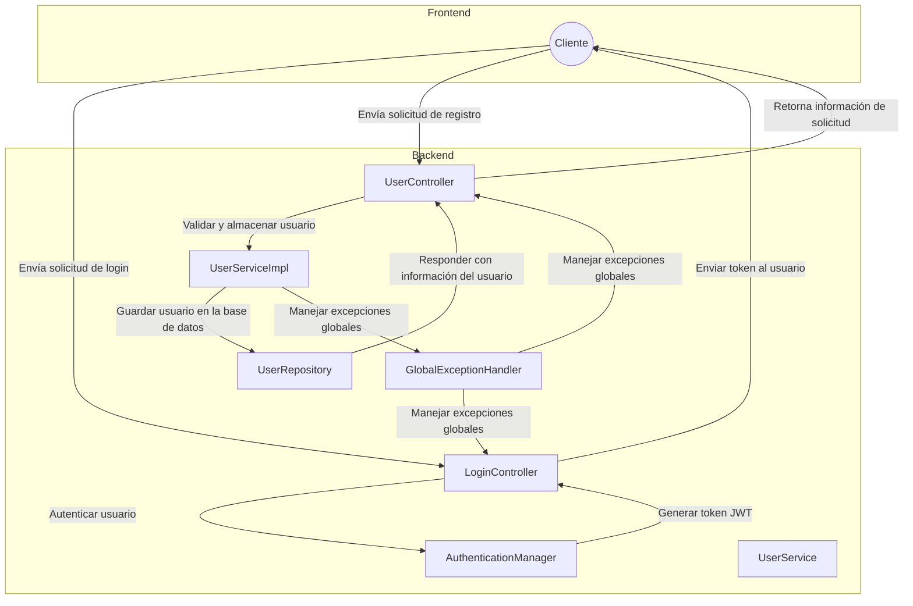

### Diagrama de componentes

```mermaid
graph TD
    subgraph Frontend
        A((Cliente))
    end

    subgraph Backend
        B[UserController]
        C[LoginController]
        D[AuthenticationManager]
        E[UserService]
        F[UserServiceImpl]
        G[UserRepository]
        H[GlobalExceptionHandler]
    end

    A -->|Envía solicitud de login| C
    C -->|Autenticar usuario| D
    D -->|Generar token JWT| C
    C -->|Enviar token al usuario| A

    A -->|Envía solicitud de registro| B
    B -->|Retorna información de solicitud| A
    B -->|Validar y almacenar usuario| F
    F -->|Guardar usuario en la base de datos| G
    G -->|Responder con información del usuario| B
    H -->|Manejar excepciones globales| B
    H -->|Manejar excepciones globales| C
    F -->|Manejar excepciones globales| H

```
