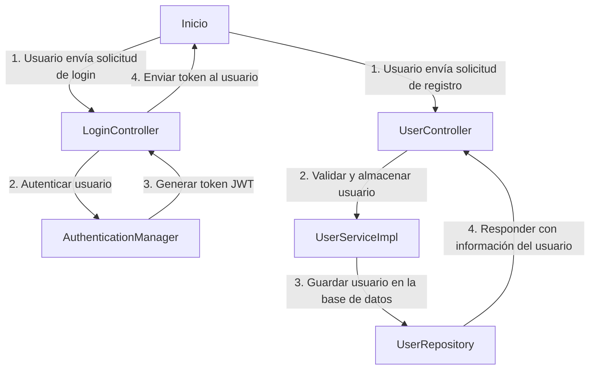

### Diagrama de Flujo

```mermaid
graph TD
    A[Inicio] -->|1. Usuario envía solicitud de login| B[LoginController]
    B -->|2. Autenticar usuario| C[AuthenticationManager]
    C -->|3. Generar token JWT| B
    B -->|4. Enviar token al usuario| A

    A -->|1. Usuario envía solicitud de registro| D[UserController]
    D -->|2. Validar y almacenar usuario| E[UserServiceImpl]
    E -->|3. Guardar usuario en la base de datos| F[UserRepository]
    F -->|4. Responder con información del usuario| D

```
