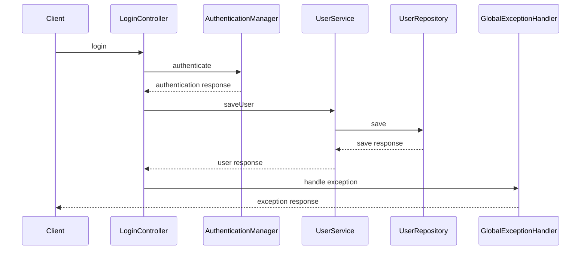
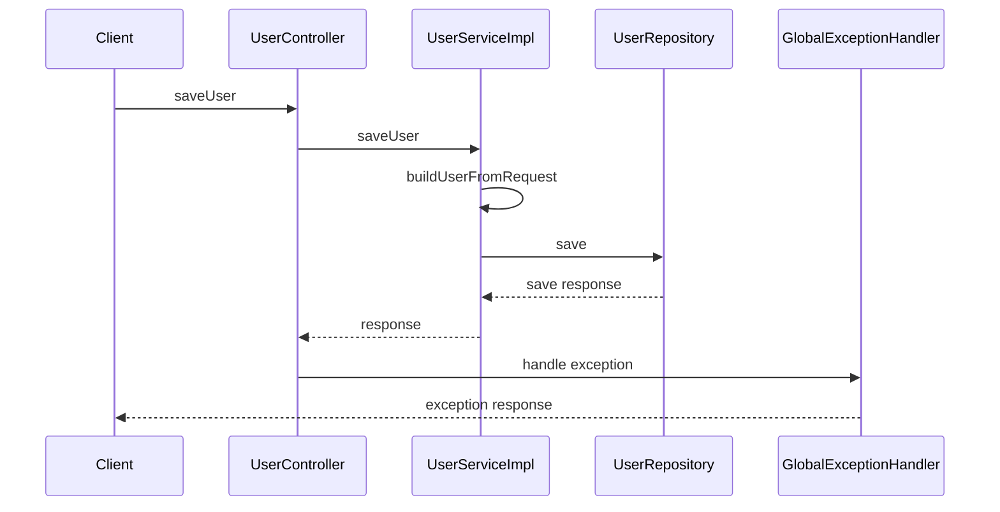

### Diagrama de secuencia
#### Login

```mermaid
sequenceDiagram
    participant Client
    participant LoginController
    participant AuthenticationManager
    participant UserService
    participant UserRepository
    participant GlobalExceptionHandler

    Client->>LoginController: login
    LoginController->>AuthenticationManager: authenticate
    AuthenticationManager-->>LoginController: authentication response
    LoginController->>UserService: saveUser
    UserService->>UserRepository: save
    UserRepository-->>UserService: save response
    UserService-->>LoginController: user response
    LoginController->>GlobalExceptionHandler: handle exception
    GlobalExceptionHandler-->>Client: exception response

```
#### Save User

```mermaid
sequenceDiagram
  participant Client
  participant UserController
  participant UserServiceImpl
  participant UserRepository
  participant GlobalExceptionHandler

  Client->>UserController: saveUser
  UserController->>UserServiceImpl: saveUser
  UserServiceImpl->>UserServiceImpl: buildUserFromRequest
  UserServiceImpl->>UserRepository: save
  UserRepository-->>UserServiceImpl: save response
  UserServiceImpl-->>UserController: response
  UserController->>GlobalExceptionHandler: handle exception
  GlobalExceptionHandler-->>Client: exception response

```

